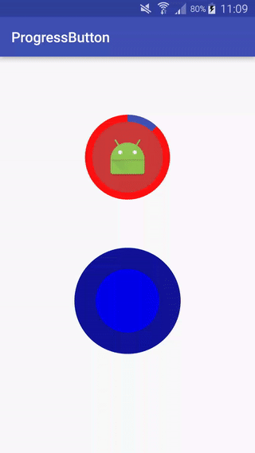

# ProgressButton
-------
A circular progress button for Android that you can use to show indeterminate of determinate progress.



## Integration
-------
Gradle:
```groovy
dependencies {
    compile 'be.appfoundry.progressbuttonlibrary.progress-button:0.9.1'
}
```

## Usage
-------
In the project you can find a sample app where the use of the button is demonstrated for indeterminate and determinate progress.

Example view implementation:
```
<be.appfoundry.progressbutton.ProgressButton
        android:id="@+id/progressButton"
        android:layout_width="120dp"
        android:layout_height="120dp"
        android:layout_gravity="center"
        progressbutton:fillColor="#ffcd3a3a"
        progressbutton:progressColor="@color/colorPrimary"
        progressbutton:strokeWidth="10dp"
        progressbutton:strokeColor="#FF1010"
        progressbutton:progressIcon="@drawable/ic_settings_remote_white_36dp"
        progressbutton:indeterminate="true"/>
```

* **fillColor** (color) - Set the background color of the button.

    ```
    progressbutton:fillColor="#ffcd3a3a"
    ```
    
* **progressColor** (color) - Set the color of the progress indicator.

    ```
    progressbutton:progressColor="@color/colorPrimary"
    ```
    
* **strokeColor** (color) - Set the color of the border.

    ```
    progressbutton:strokeColor="#FF1010"
    ```
    
* **strokeWidth** (size) - Set the border width.

    ```
    progressbutton:strokeWidth="10dp"
    ```
    
* **progressIcon** (drawable) - Set an icon on the button.

    ```
    progressbutton:progressIcon="@drawable/ic_settings_remote_white_36dp"
    ```
    
* **indeterminate** (boolean) - Set whether the button is indeterminate or determinate.

    ```
    progressbutton:indeterminate="true"
    ```

Code example:
```
    progressButton.setIndeterminate(true);
    progressButton.setAnimationStep(3);
    progressButton.setAnimationDelay(0);

    progressButton.setOnTouchListener(new View.OnTouchListener() {
        @Override
        public boolean onTouch(View v, MotionEvent event) {
            switch (event.getAction()) {
                case MotionEvent.ACTION_DOWN:
                    progressButton.startAnimating();
                    break;
                case MotionEvent.ACTION_UP:
                    progressButton.stopAnimating();
                    break;
            }
            return true;
        }
    });
```

* **setIndeterminate(boolean isIndeterminate)** - Set whether the button is indeterminate or determinate.

    ```
    progressButton.setIndeterminate(true);
    ```
    
* **setAnimationStep(float animationStep)** - Set the amount of progress for each animation step.

    ```
    progressButton.setAnimationStep(3);
    ```

* **setAnimationDelay(float animationStep)** - Set the delay in milliseconds after each animation step to determine the speed of the animation.

    ```
    progressButton.setAnimationDelay(0);
    ```
    
* **startAnimating()** - Start the indeterminate progress animation.

    ```
    progressButton.startAnimating();
    ```
    
* **stopAnimating()** - Stop the indeterminate progress animation.

    ```
    progressButton.stopAnimating();
    ```
    
* **setMaxProgress(float maxProgress)** - Set the maximum progress value for determinate progress.

    ```
    progressButton.setMaxProgress(10.0f);
    ```
    
* **setProgress(float animationStep)** - Set the progress value for determinate progress.

    ```
    progressButton.setProgress(5.0f);
    ```
        
* **setStartDegrees(float degrees)** - Set the starting point for the progress indicator. (0 for left, 90 for bottom, ...)

    ```
    progressButton.setStartDegrees(270);
    ```
    
* **setIcon(Drawable icon)** - Set icon on the button.

    ```
    progressButton.setIcon(getResources().getDrawable(R.drawable.icon));
    ```
            
## License
-------
```
Licensed under the Apache License, Version 2.0 (the "License");
you may not use this file except in compliance with the License.
You may obtain a copy of the License at

   http://www.apache.org/licenses/LICENSE-2.0

Unless required by applicable law or agreed to in writing, software
distributed under the License is distributed on an "AS IS" BASIS,
WITHOUT WARRANTIES OR CONDITIONS OF ANY KIND, either express or implied.
See the License for the specific language governing permissions and
limitations under the License.
```
